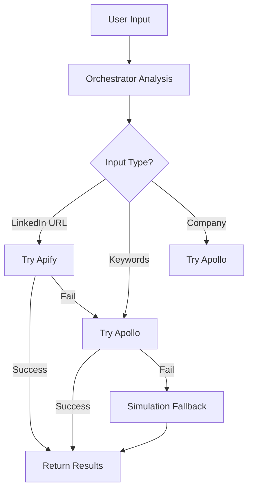

# SAM AI Intelligent Prospect Extraction Flow

## 🎯 Smart System Overview

**No user choice required** - The system intelligently determines the best extraction method based on input type and available services.

## 🔄 Extraction Priority Logic

### LinkedIn Search URLs (Primary Use Case)
```
Input: https://www.linkedin.com/search/results/people/?keywords=marketing%20manager

🥇 PRIMARY: Apify MCP
   ├─ Reason: Direct URL processing - perfect match
   ├─ Quality: Excellent 
   ├─ Cost: ~$0.01/prospect
   └─ Handles: LinkedIn search, Sales Navigator, profile URLs

🥈 BACKUP: Apollo MCP  
   ├─ Reason: Parse URL criteria, search Apollo database
   ├─ Quality: Excellent (verified emails)
   ├─ Cost: ~$0.02/prospect  
   └─ Handles: Keyword extraction from URL

🥉 FALLBACK: Simulation
   ├─ Reason: Demo/development mode
   ├─ Quality: Fair
   └─ Cost: Free
```

### Text Keywords
```
Input: "marketing managers in San Francisco"

🥇 PRIMARY: Apollo MCP
   ├─ Reason: Superior B2B database for keyword searches
   ├─ Quality: Excellent
   └─ Cost: ~$0.02/prospect

🥈 BACKUP: Simulation
   └─ Reason: Fallback for demo
```

### Company Domains  
```
Input: "slack.com" or "employees at Slack"

🥇 PRIMARY: Apollo MCP
   ├─ Reason: Company employee search
   ├─ Quality: Excellent
   └─ Cost: ~$0.025/prospect

🥈 BACKUP: Simulation
   └─ Reason: Fallback for demo
```

## 🛠 MCP Configuration

### Server Priority Order
1. **Apify MCP** - Primary for LinkedIn URLs
2. **Apollo MCP** - Backup for verified data
3. **Bright Data MCP** - Custom scraping fallback

### Environment Variables
```bash
# Apify (Primary)
APIFY_API_TOKEN=your_apify_token

# Apollo (Backup)  
APOLLO_API_KEY=your_apollo_key

# Bright Data (Fallback)
BRIGHTDATA_USERNAME=your_username
BRIGHTDATA_PASSWORD=your_password
BRIGHTDATA_ZONE=your_zone
```

## 📊 Quality Assessment Matrix

| Source | Email Accuracy | Completeness | LinkedIn URLs | Phone Numbers |
|--------|---------------|--------------|---------------|---------------|
| **Apollo** | 95%+ verified | 90%+ complete | 70% available | 60% available |
| **Apify** | 70% estimated | 85% complete | 100% available | 30% available |
| **Simulation** | N/A | 100% mock | 100% mock | 50% mock |

## 🎯 User Experience Flow

### 1. User Pastes LinkedIn URL
```typescript
// User action: Paste URL in AddPeopleTab
const url = "https://www.linkedin.com/search/results/people/?keywords=cto";

// System automatically:
// ✅ Detects this is a LinkedIn search URL  
// ✅ Chooses Apify as primary method
// ✅ Falls back to Apollo if Apify fails
// ✅ Shows progress: "Extracting with Apify..."
// ✅ Returns prospects with source transparency
```

### 2. System Intelligence
```typescript
// Orchestrator decides automatically:
const result = await prospectOrchestrator.extractProspects(input);

// Returns:
{
  success: true,
  prospects: [...],
  method_used: "apify",           // Transparency
  data_quality: "excellent",      // Quality assessment  
  cost_estimate: 0.85,           // Cost tracking
  processing_time_ms: 3200       // Performance metrics
}
```

### 3. UI Feedback
```typescript
// User sees intelligent feedback:
"✅ Extracted 47 prospects using Apify"
"📊 Data quality: Excellent" 
"💰 Cost: $0.85"
"⏱ Completed in 3.2 seconds"
```

## 🔧 Implementation Files

### Core Services
- `prospectOrchestrator.ts` - Smart decision engine
- `apifyMcp.ts` - Apify MCP integration  
- `apolloMcp.ts` - Apollo MCP integration
- `linkedinExtractor.ts` - Legacy wrapper (updated)

### Configuration
- `mcp.json` - MCP server definitions
- `AddPeopleTab.tsx` - UI integration

### Process Flow


## 🚀 Deployment Checklist

### Immediate (Demo Ready)
- ✅ Simulation mode working
- ✅ Smart orchestrator implemented
- ✅ UI shows method transparency

### Production Setup
- [ ] Add `APIFY_API_TOKEN` to Netlify env vars
- [ ] Add `APOLLO_API_KEY` to Netlify env vars  
- [ ] Test with real LinkedIn URLs
- [ ] Monitor costs and quality

### Advanced Features
- [ ] Predefined Apify actor for SAM AI
- [ ] Custom Apollo search templates
- [ ] Cost optimization rules
- [ ] A/B testing between sources

## 💡 Key Benefits

1. **Zero User Confusion** - System chooses automatically
2. **URL-First Approach** - Apify handles LinkedIn URLs natively  
3. **High-Quality Fallback** - Apollo provides verified emails
4. **Cost Optimization** - Cheapest effective method first
5. **Transparency** - User knows what method was used
6. **Graceful Degradation** - Always falls back to simulation

This intelligent system ensures users get the best possible prospect data without having to understand the technical complexity behind the scenes.