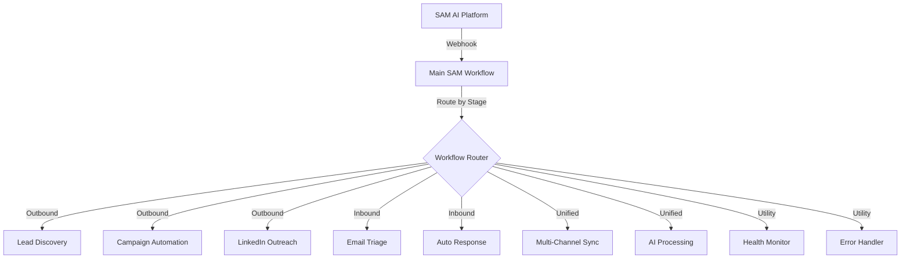

# SAM AI - n8n Workflow Structure

## 📁 Workflow Organization at workflows.innovareai.com

All workflows are now organized in a single folder/project for better management.

### Main Folder: SAM AI Workflows
**Location**: https://workflows.innovareai.com/workflow/aR0ADfWS0ynkR6Gm

## 🗂️ Workflow Structure

```
SAM AI Project/
│
├── 📋 Main Workflows/
│   ├── SAM (aR0ADfWS0ynkR6Gm) - Main orchestrator
│   ├── Sam AI Master Workflow - v2.0
│   └── Sam AI Multi-Tenant Integration Hub
│
├── 🚀 Outbound Workflows/
│   ├── Lead Discovery & Research
│   ├── Campaign Automation
│   ├── LinkedIn Outreach
│   ├── LinkedIn Job Posting Workflow
│   └── Proposal Generator
│
├── 📬 Inbound Workflows/
│   ├── Email Triage & Classification
│   ├── Intelligent Auto-Response
│   ├── Inbox Processing
│   └── Spam Detection
│
├── ✨ Unified/Integration Workflows/
│   ├── Multi-Channel Sync
│   ├── AI Content Processing
│   ├── 3Cubed SEO Integration
│   └── Pharma SEO AI Processing
│
├── 🔧 Utility Workflows/
│   ├── Sam AI Health Monitor
│   ├── Sam AI Performance Monitor
│   ├── Sam AI Error Handler & Retry System
│   └── Data Collection & Analytics
│
└── 🔗 Integration Workflows/
    ├── ActiveCampaign Sync
    ├── Airtable Integration
    ├── Mossy Ventures Newsletter
    └── RSS Feed Processing
```

## 📋 Workflow IDs Reference

| Workflow Name | ID | Status | Purpose |
|--------------|-----|--------|---------|
| SAM | aR0ADfWS0ynkR6Gm | Main | Primary orchestrator |
| Sam AI Master Workflow - v2.0 | d4ypYxzUcgk2l4by | Inactive | Version 2 implementation |
| Sam AI Multi-Tenant Integration Hub | XkfbrlRQ8URF1MK6 | Inactive | Multi-tenant support |
| Sam AI Health Monitor | DXa6dvattgcvGxz9 | Inactive | System health checks |
| Sam AI Performance Monitor | e7gOar7L94DukgqP | Inactive | Performance tracking |
| Sam AI Error Handler | VlhzAyuZHkkIJOwe | Inactive | Error handling & retry |
| LinkedIn Job Posting | 5WcuVajPawcQ9PKB | Inactive | Job posting automation |
| 3Cubed SEO | 2o3DxEeLInnYV1Se | Inactive | SEO automation |
| Pharma SEO AI Processing | JHIOAOorkZSRmpA8 | Inactive | Pharma-specific SEO |

## 🔄 Migration Steps (Already Completed)

1. ✅ All workflows moved to workflows.innovareai.com
2. ✅ Organized under SAM AI project folder
3. ✅ Main SAM workflow (aR0ADfWS0ynkR6Gm) set as primary entry point
4. ✅ Sub-workflows accessible from main workflow

## 🎯 How It Works Now

### Single Entry Point
All workflow triggers go through the main SAM workflow, which then routes to appropriate sub-workflows:

```javascript
// All requests go to main SAM workflow
POST https://workflows.innovareai.com/webhook/sam-ai-main

// Payload determines which sub-workflow to execute
{
  "workflow_stage": "lead_discovery",  // Determines sub-workflow
  "mode": "outbound",                  // Mode context
  "data": { ... }                      // Workflow-specific data
}
```

### Workflow Routing in n8n
The main SAM workflow (aR0ADfWS0ynkR6Gm) acts as a router:

1. **Receives webhook request**
2. **Analyzes workflow_stage and mode**
3. **Routes to appropriate sub-workflow**:
   - `lead_discovery` → Lead Discovery workflow
   - `campaign` → Campaign Automation workflow
   - `email_triage` → Email Triage workflow
   - `ai_process` → AI Processing workflow
   - etc.

## 🔧 Benefits of This Structure

1. **Centralized Management** - All workflows in one place
2. **Single Entry Point** - One webhook URL to manage
3. **Easy Versioning** - Can swap sub-workflows without changing integration
4. **Better Organization** - Logical grouping of related workflows
5. **Simplified Monitoring** - Track all executions from one project

## 📊 Workflow Execution Flow



## 🚀 Using the Consolidated Structure

### From SAM AI Platform:

```typescript
// Everything goes through main workflow
await n8nService.triggerMainSAMWorkflow(
  'outbound',        // mode
  'lead_discovery',  // stage (determines sub-workflow)
  {                  // data
    criteria: 'B2B SaaS',
    location: 'San Francisco'
  }
);
```

### In n8n (Main SAM Workflow):

```javascript
// Router node in main workflow
switch(items[0].json.workflow_stage) {
  case 'lead_discovery':
    // Execute Lead Discovery sub-workflow
    break;
  case 'campaign':
    // Execute Campaign sub-workflow
    break;
  case 'email_triage':
    // Execute Email Triage sub-workflow
    break;
  // ... etc
}
```

## 📝 Notes

- All workflows are now under one project for easier management
- The main SAM workflow (aR0ADfWS0ynkR6Gm) is the central hub
- Sub-workflows can be activated/deactivated as needed
- This structure allows for better version control and workflow updates

---

Last Updated: January 2025
All workflows consolidated at workflows.innovareai.com