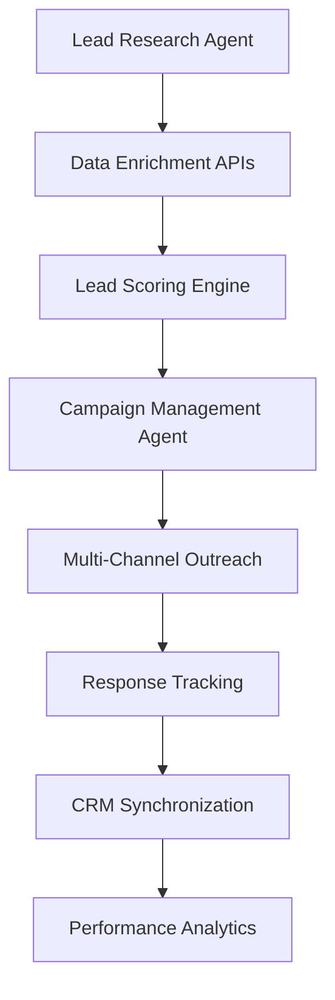
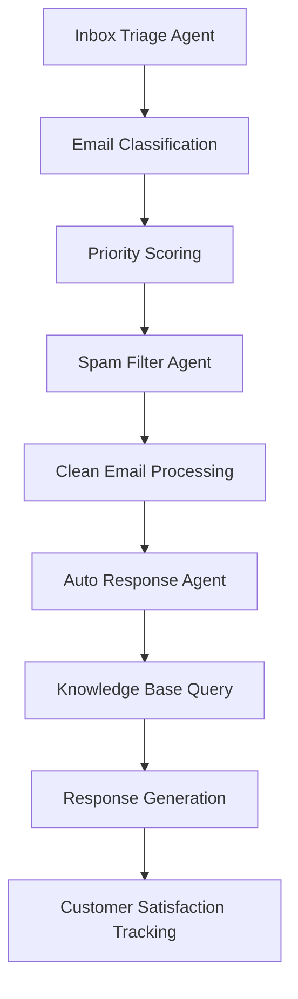

# SAM AI - Technical Specifications & B2B vs B2C Agent Architecture

## Executive Summary

This document provides comprehensive technical specifications for SAM AI's multi-agent architecture, defining clear B2B (outbound) and B2C (inbound) role distinctions, API integrations, and data flow patterns. Based on research into Unipile API and Model Context Protocol (MCP) for social media network integrations.

---

## 🏗️ SYSTEM ARCHITECTURE OVERVIEW

### Core Infrastructure
- **Frontend**: React 18, TypeScript, Vite, shadcn/ui, Tailwind CSS
- **Backend**: Supabase (PostgreSQL, Auth, Edge Functions)
- **AI Models**: GPT-5 (primary), Claude-4 (specialized tasks)
- **Social Integration**: Unipile API, MCP Protocol
- **Workflow Orchestration**: n8n
- **Data Storage**: Vector embeddings (pgvector), JSON documents
- **Real-time Communication**: WebSockets, Supabase Realtime

### Agent Communication Protocol
```typescript
interface AgentMessage {
  id: string;
  type: 'task_request' | 'task_response' | 'status_update';
  from: string; // agent identifier
  to: string; // target agent or orchestrator
  payload: any;
  metadata: {
    timestamp: Date;
    priority: 'low' | 'medium' | 'high' | 'critical';
    businessContext: 'b2b' | 'b2c' | 'internal';
  };
}
```

---

## 🎯 B2B vs B2C OPERATIONAL MODES

### B2B Mode (Outbound Focus)
**Primary Objective**: Revenue generation through proactive lead acquisition
**Key Metrics**: Pipeline value, conversion rates, deal velocity
**Data Sources**: LinkedIn Sales Navigator, Apollo.io, ZoomInfo
**Integration Priority**: CRM, sales tools, prospecting platforms

### B2C Mode (Inbound Focus) 
**Primary Objective**: Customer satisfaction through efficient service delivery
**Key Metrics**: Response time, resolution rate, CSAT scores
**Data Sources**: Support tickets, FAQ databases, product documentation
**Integration Priority**: Help desk, chat platforms, knowledge bases

---

## 🤖 SPECIALIST AGENT SPECIFICATIONS

### 1. **Orchestrator Agent** (Universal)

**Business Context**: Both B2B and B2C
**Primary Function**: Central coordinator and traffic controller
**Technical Specifications**:

```typescript
class OrchestratorAgent {
  // Core capabilities
  private intentClassification: IntentClassifier;
  private agentRouter: AgentRouter;
  private contextManager: ContextManager;
  
  // API integrations
  private openaiClient: OpenAIClient;
  private anthropicClient: AnthropicClient;
  private supabaseClient: SupabaseClient;
  
  // Business logic routing
  public routeRequest(request: TaskRequest): Promise<AgentAssignment> {
    const businessContext = this.detectBusinessContext(request);
    const priority = this.calculatePriority(request, businessContext);
    return this.assignOptimalAgent(request, businessContext, priority);
  }
}
```

**B2B Role**: Routes to sales-focused agents, prioritizes revenue-generating activities
**B2C Role**: Routes to service-focused agents, prioritizes customer satisfaction
**API Dependencies**: OpenAI GPT-5, Anthropic Claude-4, Supabase

---

### 2. **Lead Research Agent** (B2B Primary)

**Business Context**: B2B Outbound
**Primary Function**: Advanced prospect intelligence and qualification
**Technical Specifications**:

```typescript
interface LeadResearchCapabilities {
  linkedinResearch: {
    provider: 'unipile' | 'brightdata';
    endpoints: ['/linkedin/profile', '/linkedin/company', '/linkedin/posts'];
    rateLimits: { rpm: 60, dailyLimit: 1000 };
  };
  dataEnrichment: {
    providers: ['apollo', 'zoominfo', 'clearbit'];
    confidence: number; // 0.0-1.0
    sources: string[];
  };
  leadScoring: {
    algorithm: 'meddic' | 'bant' | 'champion_challenger';
    factors: IcpFactor[];
    weights: number[];
  };
}
```

**API Integrations**:
- **Unipile API**: LinkedIn data extraction (€49/month, 10 accounts)
- **Apollo.io**: Contact enrichment and verification
- **ZoomInfo**: Company intelligence and buying signals
- **Clearbit**: Email verification and company data

**B2B Use Cases**:
- Prospect qualification and scoring
- Buying intent signal detection
- Competition analysis
- Decision-maker identification

**B2C Application**: Limited to company research for enterprise customer support

---

### 3. **Campaign Management Agent** (B2B Primary)

**Business Context**: B2B Outbound
**Primary Function**: Multi-channel outreach orchestration
**Technical Specifications**:

```typescript
interface CampaignManagement {
  channels: {
    linkedin: UnipileLinkedInAPI;
    email: SendGridAPI;
    phone: TwilioAPI;
    video: LoomAPI;
  };
  sequencing: {
    touchPoints: TouchPoint[];
    delays: DelayConfiguration;
    conditions: TriggerCondition[];
  };
  analytics: {
    tracking: AnalyticsProvider[];
    attribution: AttributionModel;
    optimization: A_B_TestConfig;
  };
}
```

**API Integrations**:
- **Unipile LinkedIn API**: Connection requests, InMail, engagement
- **SendGrid**: Email delivery and tracking
- **Twilio**: SMS and voice outreach
- **HubSpot/Salesforce**: CRM synchronization

**B2B Use Cases**:
- Multi-touch sales sequences
- Account-based marketing campaigns
- Pipeline tracking and optimization
- Performance attribution

**B2C Application**: Customer communication campaigns, retention sequences

---

### 4. **Sales Content Creation Agent** (Universal)

**Business Context**: Both B2B and B2C
**Primary Function**: Sales-focused messaging and collateral generation
**Technical Specifications**:

```typescript
interface SalesContentCreation {
  personalization: {
    levels: ['basic', 'industry', 'pain_point', 'custom_research'];
    sources: DataSource[];
    templates: MessageTemplate[];
  };
  sales_collateral: {
    pitch_decks: PitchDeckGenerator;
    case_studies: CaseStudyBuilder;
    roi_calculators: ROICalculator;
    value_props: ValuePropGenerator;
  };
  messaging: {
    outreach_sequences: SequenceBuilder;
    follow_ups: FollowUpGenerator;
    objection_handling: ObjectionResponses;
    meeting_invites: MeetingInviteTemplates;
  };
  optimization: {
    a_b_testing: A_B_TestFramework;
    performance_tracking: ResponseRateMetrics;
    continuous_learning: MessageOptimization;
  };
}
```

**API Integrations**:
- **OpenAI GPT-5**: Sales copy generation and optimization
- **Anthropic Claude-4**: Complex sales scenario analysis
- **CRM APIs**: Customer data for personalization
- **Analytics APIs**: Performance tracking and optimization

**B2B Role**: 
- Cold outreach sequences
- Sales presentations and pitch decks
- Competitive battle cards
- ROI justification documents
- Proposal templates

**B2C Role**:
- Customer service response templates
- Support resolution scripts
- Onboarding communication sequences
- Retention messaging

---

### 5. **GTM Strategy Agent** (B2B Primary)

**Business Context**: B2B Outbound
**Primary Function**: Go-to-market strategy and market analysis
**Technical Specifications**:

```typescript
interface GTMStrategy {
  marketAnalysis: {
    tam_sam_som: MarketSizing;
    competitive_intelligence: CompetitorAnalysis;
    trend_analysis: MarketTrends;
  };
  icp_development: {
    firmographic: FirmographicCriteria;
    technographic: TechnographicCriteria;
    behavioral: BehavioralCriteria;
  };
  messaging_framework: {
    value_props: ValueProposition[];
    messaging_pillars: MessagingPillar[];
    competitive_differentiators: string[];
  };
}
```

**API Integrations**:
- **Pitchbook API**: Market sizing and competition data
- **Crunchbase API**: Startup and funding intelligence
- **Google Trends API**: Market trend analysis

**B2B Use Cases**:
- Market opportunity assessment
- Competitive positioning analysis
- ICP refinement and targeting
- Revenue forecasting
- Messaging framework development

**B2C Application**: Market research for customer segmentation

---

### 5. **MEDDIC Qualification Agent** (B2B Primary)

**Business Context**: B2B Outbound
**Primary Function**: Lead qualification and deal assessment
**Technical Specifications**:

```typescript
interface MEDDICQualification {
  metrics: {
    quantifiable_impact: number;
    measurement_criteria: string[];
    success_metrics: KPI[];
  };
  economic_buyer: {
    identification: StakeholderMapping;
    influence_level: number;
    decision_authority: boolean;
  };
  decision_criteria: {
    requirements: Requirement[];
    evaluation_process: EvaluationStep[];
    timeline: Timeline;
  };
  decision_process: {
    stakeholders: Stakeholder[];
    approval_workflow: ApprovalStep[];
    timeline: ProcessTimeline;
  };
  identify_pain: {
    pain_points: PainPoint[];
    urgency_level: number;
    impact_assessment: BusinessImpact;
  };
  champion: {
    identification: ChampionProfile;
    influence_mapping: InfluenceMap;
    coaching_plan: ChampionStrategy;
  };
}
```

**API Integrations**:
- **Salesforce/HubSpot**: Opportunity management
- **Gong.io**: Call analysis and qualification insights
- **Chorus.ai**: Conversation intelligence
- **LinkedIn Sales Navigator**: Stakeholder mapping

**B2B Use Cases**:
- Deal qualification and scoring
- Sales process optimization
- Win/loss analysis
- Champion identification

**B2C Application**: Not applicable (B2C doesn't typically use MEDDIC)

---

### 7. **Workflow Automation Agent** (Universal)

**Business Context**: Both B2B and B2C
**Primary Function**: Process automation and system integration
**Technical Specifications**:

```typescript
interface WorkflowAutomation {
  triggers: {
    time_based: CronSchedule;
    event_based: WebhookTrigger;
    condition_based: ConditionalTrigger;
  };
  actions: {
    crm_updates: CRMAction[];
    notifications: NotificationAction[];
    data_sync: SyncAction[];
    api_calls: APIAction[];
  };
  integration: {
    n8n: N8nWorkflow;
    zapier: ZapierIntegration;
    custom: CustomAutomation;
  };
}
```

**API Integrations**:
- **n8n**: Workflow orchestration and automation
- **Zapier**: Cross-platform integrations
- **Webhooks**: Real-time event handling
- **Database APIs**: Data synchronization

**B2B Role**: Lead routing, deal progression, sales process automation
**B2C Role**: Ticket routing, escalation workflows, customer journey automation

---

### 8. **Inbox Triage Agent** (B2C Primary)

**Business Context**: B2C Inbound
**Primary Function**: Email classification and prioritization
**Technical Specifications**:

```typescript
interface InboxTriage {
  classification: {
    categories: EmailCategory[];
    confidence: number;
    auto_actions: AutoAction[];
  };
  prioritization: {
    scoring_algorithm: PriorityScoring;
    sla_mapping: SLAConfiguration;
    escalation_rules: EscalationRule[];
  };
  processing: {
    batch_size: number;
    processing_speed: number; // emails per minute
    accuracy_rate: number;
  };
}
```

**API Integrations**:
- **Gmail API**: Email access and manipulation
- **Outlook API**: Microsoft email integration
- **Slack API**: Team notifications
- **Zendesk API**: Ticket creation

**B2C Use Cases**:
- Customer inquiry classification
- Priority-based routing
- SLA compliance monitoring
- Auto-response generation

**B2B Application**: Lead inquiry processing, sales email management

---

### 9. **Spam Filter Agent** (B2C Primary)

**Business Context**: B2C Inbound
**Primary Function**: Advanced threat detection and content filtering
**Technical Specifications**:

```typescript
interface SpamFiltering {
  detection_layers: {
    sender_reputation: ReputationScore;
    content_analysis: ContentAnalysis;
    behavioral_patterns: BehavioralAnalysis;
    ml_classification: MLModel;
  };
  threat_protection: {
    phishing_detection: PhishingModel;
    malware_scanning: MalwareScanner;
    social_engineering: SocialEngineeringDetector;
  };
  performance: {
    accuracy: 99.7; // percentage
    false_positive_rate: 0.1; // percentage
    processing_speed: 100; // emails per second
  };
}
```

**API Integrations**:
- **VirusTotal API**: Malware and threat detection
- **PhishTank API**: Phishing URL database
- **SpamAssassin**: Content-based spam detection
- **Domain reputation APIs**: Sender verification

**B2C Use Cases**:
- Email security and filtering
- Customer protection from scams
- Inbox cleanliness maintenance
- Threat reporting and analysis

**B2B Application**: Executive protection, business email security

---

### 10. **Auto Response Agent** (B2C Primary)

**Business Context**: B2C Inbound
**Primary Function**: Intelligent automated response generation
**Technical Specifications**:

```typescript
interface AutoResponse {
  response_generation: {
    template_matching: TemplateEngine;
    dynamic_content: ContentGenerator;
    personalization: PersonalizationEngine;
  };
  routing_logic: {
    faq_matching: FAQMatcher;
    escalation_triggers: EscalationTrigger[];
    human_handoff: HandoffCriteria;
  };
  multi_language: {
    supported_languages: string[]; // 25+ languages
    translation_api: TranslationService;
    cultural_adaptation: CulturalContext;
  };
}
```

**API Integrations**:
- **OpenAI GPT-5**: Dynamic response generation
- **Google Translate API**: Multi-language support
- **Calendar APIs**: Meeting scheduling
- **Knowledge Base APIs**: FAQ retrieval

**B2C Use Cases**:
- Customer service automation
- FAQ responses
- Appointment scheduling
- Information delivery

**B2B Application**: Lead inquiry responses, meeting coordination

---

### 11. **Knowledge Base Agent** (Universal)

**Business Context**: Both B2B and B2C
**Primary Function**: Information management and intelligent retrieval
**Technical Specifications**:

```typescript
interface KnowledgeBase {
  storage: {
    vector_database: PgVector;
    document_store: SupabaseStorage;
    search_index: ElasticSearch;
  };
  processing: {
    document_chunking: ChunkingStrategy;
    embedding_generation: EmbeddingModel;
    semantic_search: SemanticSearchEngine;
  };
  retrieval: {
    context_aware: ContextualRetrieval;
    relevance_scoring: RelevanceModel;
    source_attribution: SourceTracking;
  };
}
```

**API Integrations**:
- **OpenAI Embeddings**: Document vectorization
- **Supabase**: Vector storage and search
- **MCP Protocol**: External data source connections
- **Document APIs**: Content ingestion

**B2B Role**: Sales enablement, competitive intelligence, product documentation
**B2C Role**: Customer support knowledge, troubleshooting guides, FAQ management

---

## 🔗 SOCIAL MEDIA INTEGRATION ARCHITECTURE

### Unipile API Integration

**Technical Specifications**:
```typescript
interface UnipileIntegration {
  authentication: {
    api_key: string;
    account_limit: 10; // per subscription
    pricing: "€49/month";
  };
  supported_platforms: {
    linkedin: UnipileLinkedIn;
    twitter: UnipileTwitter;
    instagram: UnipileInstagram;
    whatsapp: UnipileWhatsApp;
    messenger: UnipileMessenger;
  };
  unified_api: {
    message_sending: UnifiedMessaging;
    contact_sync: ContactSynchronization;
    conversation_history: ConversationHistory;
  };
}
```

**B2B Applications**:
- LinkedIn prospecting and outreach
- Multi-platform relationship building
- Social selling automation
- Professional network expansion

**B2C Applications**:
- Customer service across social channels
- Community management
- Social media engagement
- Customer support via messaging

### MCP (Model Context Protocol) Integration

**Technical Specifications**:
```typescript
interface MCPIntegration {
  protocol: {
    version: "1.0";
    transport: "stdio" | "http" | "websocket";
    capabilities: MCPCapabilities;
  };
  data_sources: {
    social_media: SocialMediaMCP;
    crm_systems: CRM_MCP;
    databases: DatabaseMCP;
    apis: ExternalAPIMCP;
  };
  security: {
    authentication: AuthMethod;
    authorization: AuthzPolicy;
    encryption: EncryptionConfig;
  };
}
```

**Benefits**:
- Standardized external data access
- Secure third-party integrations
- Real-time data synchronization
- Scalable connector architecture

---

## 📊 DATA FLOW PATTERNS

### B2B Data Flow (Outbound Mode)


### B2C Data Flow (Inbound Mode)


---

## 🔒 SECURITY & COMPLIANCE ARCHITECTURE

### Data Protection
- **Encryption**: AES-256 at rest, TLS 1.3 in transit
- **Access Control**: RBAC with workspace isolation
- **Audit Logging**: All agent interactions tracked
- **GDPR Compliance**: Data retention and deletion policies

### API Security
- **Rate Limiting**: Per-agent and per-user quotas
- **Authentication**: JWT tokens with refresh rotation
- **Authorization**: Granular permission system
- **Monitoring**: Real-time threat detection

---

## 📈 PERFORMANCE SPECIFICATIONS

### Processing Capabilities
- **Concurrent Users**: 1,000+ per instance
- **Message Throughput**: 10,000 messages/minute
- **Response Time**: <2s for simple queries, <10s for complex analysis
- **Uptime Target**: 99.9% availability

### Scalability Metrics
- **Horizontal Scaling**: Auto-scaling based on load
- **Database Performance**: <100ms query response time
- **API Rate Limits**: Intelligent throttling and queuing
- **Memory Usage**: <2GB RAM per agent instance

---

## 🚀 DEPLOYMENT & OPERATIONS

### Infrastructure Requirements
- **Cloud Provider**: AWS/GCP/Azure with multi-region deployment
- **Container Orchestration**: Docker with Kubernetes
- **Database**: Supabase PostgreSQL with pgvector extension
- **Monitoring**: DataDog/New Relic for observability

### CI/CD Pipeline
- **Version Control**: Git with feature branch workflow
- **Testing**: Unit, integration, and E2E test suites
- **Deployment**: Blue-green deployment with rollback capability
- **Monitoring**: Real-time performance and error tracking

---

## 💰 COST OPTIMIZATION STRATEGIES

### AI Model Usage
- **Primary Model**: GPT-5 for cost-effective operations
- **Specialized Tasks**: Claude-4 for complex reasoning
- **Caching**: Intelligent response caching to reduce API calls
- **Batching**: Request batching for efficiency

### API Cost Management
- **Usage Monitoring**: Real-time cost tracking per agent
- **Rate Limiting**: Intelligent throttling based on cost/benefit
- **Provider Optimization**: Automatic provider switching based on cost
- **Budget Alerts**: Proactive cost monitoring and alerts

---

## 🔮 FUTURE EXPANSION ROADMAP

### Phase 1 (Q2 2025): Enhanced Integration
- **Advanced Social Media**: Full MCP integration for all platforms
- **Voice Integration**: Speech-to-text and text-to-speech capabilities
- **Video Processing**: Automated video generation and editing
- **Real-time Analytics**: Live dashboard with actionable insights

### Phase 2 (Q3 2025): AI Enhancement
- **Custom Model Training**: Fine-tuned models for specific use cases
- **Predictive Analytics**: Advanced forecasting and trend analysis
- **Emotional Intelligence**: Sentiment analysis and emotional response
- **Multi-modal AI**: Image, video, and audio processing capabilities

### Phase 3 (Q4 2025): Enterprise Features
- **White-label Solution**: Customizable branding and configuration
- **Enterprise Security**: SOC2, HIPAA compliance options
- **Advanced Integrations**: ERP, Advanced CRM, Custom APIs
- **Global Expansion**: Multi-language and cultural adaptation

---

## 📋 IMPLEMENTATION CHECKLIST

### Technical Prerequisites
- [ ] Supabase instance with pgvector extension
- [ ] OpenAI GPT-5 API access and keys
- [ ] Anthropic Claude-4 API access and keys
- [ ] Unipile API subscription (€49/month)
- [ ] MCP server implementations for data sources
- [ ] n8n instance for workflow orchestration

### Agent Development
- [ ] Orchestrator agent with intent classification
- [ ] B2B agent suite (Lead Research, Campaign Management, GTM, MEDDIC)
- [ ] B2C agent suite (Inbox Triage, Spam Filter, Auto Response)
- [ ] Universal agents (Content Creation, Knowledge Base, Workflow)
- [ ] API integration layers for all external services

### Testing & Validation
- [ ] Unit tests for all agent capabilities
- [ ] Integration tests for API connections
- [ ] End-to-end workflow testing
- [ ] Performance and load testing
- [ ] Security penetration testing

---

*Technical Specifications Document*  
*Version: 2.0*  
*Date: January 2025*  
*Status: Implementation Ready*