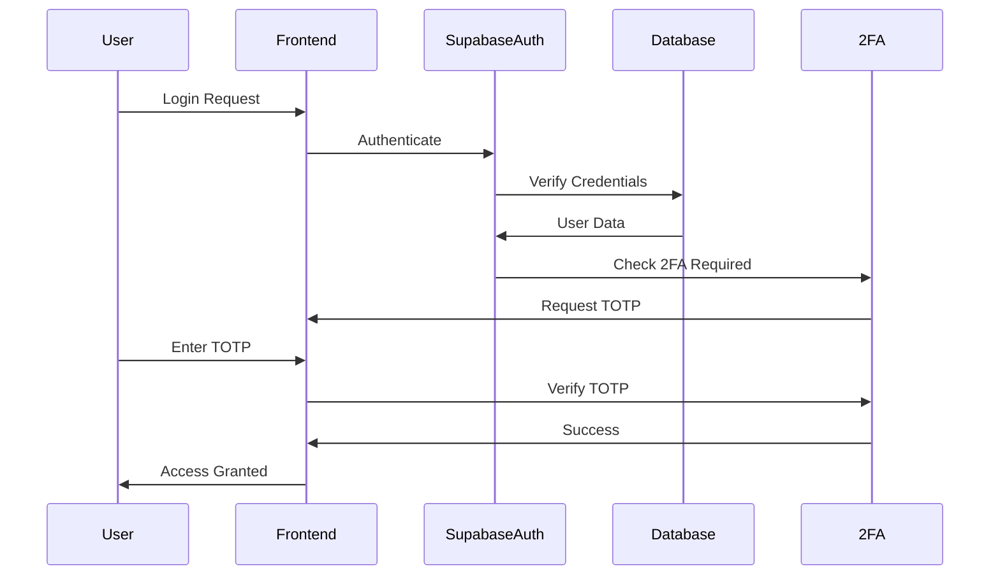
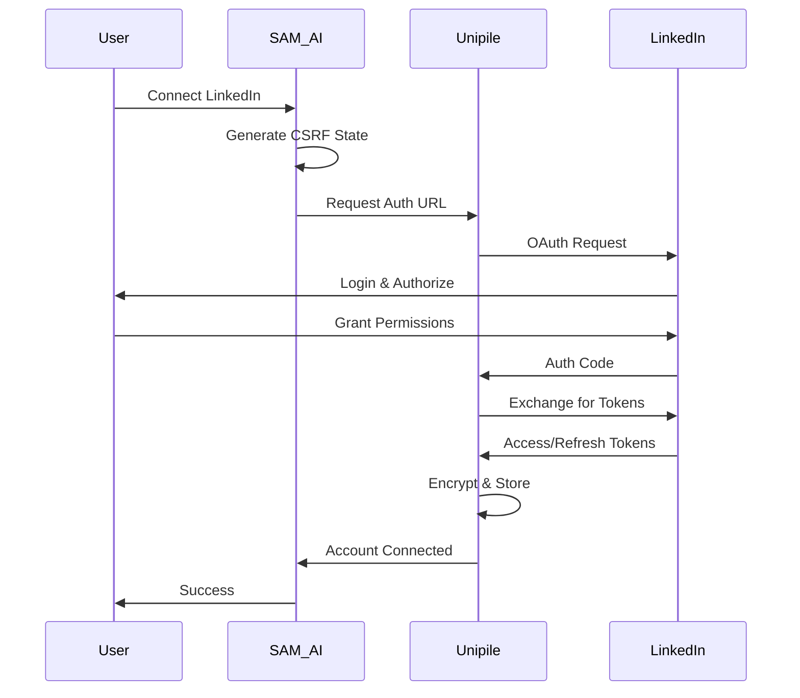
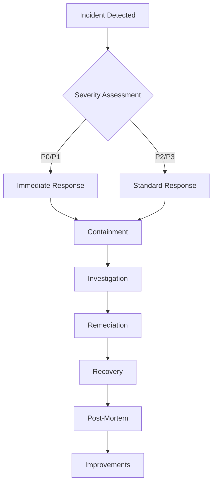

# SAM AI Platform - Security Architecture Documentation

## Executive Summary

The SAM AI platform implements enterprise-grade security measures to protect user data, LinkedIn accounts, and business intelligence. This document details our comprehensive security architecture, including authentication, authorization, data protection, and compliance measures.

## Table of Contents

1. [Security Overview](#security-overview)
2. [Authentication & Authorization](#authentication--authorization)
3. [Two-Factor Authentication (2FA)](#two-factor-authentication-2fa)
4. [OAuth Integration Security](#oauth-integration-security)
5. [Data Protection](#data-protection)
6. [Network Security](#network-security)
7. [Compliance & Auditing](#compliance--auditing)
8. [Incident Response](#incident-response)
9. [Security Best Practices](#security-best-practices)

---

## Security Overview

### Core Security Principles

1. **Defense in Depth**: Multiple layers of security controls
2. **Least Privilege**: Users and services have minimum required permissions
3. **Zero Trust**: Never trust, always verify
4. **Data Encryption**: At rest and in transit
5. **Continuous Monitoring**: Real-time threat detection and response

### Security Stack

```
┌─────────────────────────────────────┐
│         Application Layer           │
│  - React Frontend (CSP enabled)     │
│  - Input validation & sanitization  │
│  - XSS protection                   │
└─────────────────────────────────────┘
                 ↓
┌─────────────────────────────────────┐
│      Authentication Layer           │
│  - Supabase Auth                    │
│  - 2FA/MFA                          │
│  - Session management               │
└─────────────────────────────────────┘
                 ↓
┌─────────────────────────────────────┐
│       Authorization Layer           │
│  - Role-Based Access Control        │
│  - Row Level Security (RLS)         │
│  - Workspace isolation              │
└─────────────────────────────────────┘
                 ↓
┌─────────────────────────────────────┐
│         API Security Layer          │
│  - Rate limiting                    │
│  - API key management               │
│  - Request signing                  │
└─────────────────────────────────────┘
                 ↓
┌─────────────────────────────────────┐
│      Data Protection Layer          │
│  - Encryption at rest (AES-256)     │
│  - Encryption in transit (TLS 1.3)  │
│  - Key management (Vault)           │
└─────────────────────────────────────┘
                 ↓
┌─────────────────────────────────────┐
│      Infrastructure Layer           │
│  - Netlify (CDN + WAF)              │
│  - Supabase (PostgreSQL + RLS)      │
│  - Bright Data (Proxy rotation)     │
└─────────────────────────────────────┘
```

---

## Authentication & Authorization

### Authentication Flow



### Authorization Model

#### Role Hierarchy

```
workspace_manager (Full Access)
       ↓
    admin (Manage Users & Settings)
       ↓
    user (Standard Access)
       ↓
    co_worker (Limited Access)
```

#### Permission Matrix

| Action | Workspace Manager | Admin | User | Co-Worker |
|--------|------------------|-------|------|-----------|
| Manage 2FA Policy | ✅ | ✅ | ❌ | ❌ |
| View Team 2FA Status | ✅ | ✅ | ❌ | ❌ |
| Connect LinkedIn | ✅ | ✅ | ✅ | ✅ |
| Export Data | ✅ | ✅ | ✅ | ❌ |
| Bulk Operations | ✅ | ✅ | ❌ | ❌ |
| View Analytics | ✅ | ✅ | ✅ | ✅ |
| Manage Integrations | ✅ | ✅ | ❌ | ❌ |
| Invite Users | ✅ | ✅ | ❌ | ❌ |

### Session Management

- **Session Duration**: 24 hours (configurable per workspace)
- **Idle Timeout**: 30 minutes
- **Concurrent Sessions**: Limited to 3 devices
- **Session Invalidation**: On password change or 2FA disable

---

## Two-Factor Authentication (2FA)

### Implementation Details

#### TOTP Algorithm
- **Standard**: RFC 6238 TOTP
- **Hash Function**: SHA-256
- **Time Step**: 30 seconds
- **Code Length**: 6 digits
- **Window**: ±1 time step (for clock skew)

#### Secret Storage
```sql
-- Secrets are encrypted using Supabase Vault
CREATE TABLE user_two_factor (
  user_id UUID PRIMARY KEY,
  secret TEXT ENCRYPTED, -- Vault-encrypted
  enabled BOOLEAN,
  backup_codes TEXT[] ENCRYPTED
);
```

### Workspace 2FA Policies

#### Policy Enforcement Levels

1. **Optional** (Default)
   - 2FA available but not required
   - Users encouraged to enable
   - No access restrictions

2. **Required**
   - All users must enable 2FA
   - Grace period configurable (1-30 days)
   - Access restricted after grace period

3. **Role-Based**
   - Specific roles require 2FA
   - Typically: workspace_manager, admin
   - Configurable per workspace

#### Backup Codes
- **Count**: 10 single-use codes
- **Format**: 8-character alphanumeric
- **Storage**: Encrypted in database
- **Regeneration**: Available anytime
- **Usage Tracking**: Audit logged

### 2FA for Sensitive Operations

Operations requiring re-authentication:
- Disabling 2FA
- Changing password
- Generating API keys
- Bulk LinkedIn operations (>100 actions)
- Data exports
- Workspace deletion

---

## OAuth Integration Security

### LinkedIn OAuth Flow Security



### OAuth Security Measures

1. **CSRF Protection**
   - Random state parameter
   - State verification on callback
   - Time-limited states (10 minutes)

2. **Token Management**
   - Tokens never exposed to frontend
   - Stored encrypted in Unipile vault
   - Automatic refresh handling
   - Revocation on disconnect

3. **Scope Limitations**
   - Minimum required permissions
   - No password access
   - Read-only where possible

### Unipile Security

- **API Key Isolation**: Each workspace has unique keys
- **Request Signing**: HMAC-SHA256 signature
- **Rate Limiting**: Per-workspace limits
- **IP Whitelisting**: Optional restriction

---

## Data Protection

### Encryption

#### At Rest
- **Database**: AES-256-GCM encryption
- **File Storage**: Client-side encryption
- **Backups**: Encrypted with separate keys
- **Key Rotation**: Quarterly

#### In Transit
- **TLS Version**: 1.3 minimum
- **Cipher Suites**: ECDHE-RSA-AES256-GCM-SHA384
- **HSTS**: Enabled with preload
- **Certificate Pinning**: For mobile apps

### Data Classification

| Classification | Description | Protection Level |
|---------------|-------------|-----------------|
| **Critical** | OAuth tokens, passwords, 2FA secrets | Vault encryption, no frontend exposure |
| **Sensitive** | PII, LinkedIn profiles, messages | Encrypted at rest, audit logged |
| **Internal** | Analytics, metadata | Standard encryption |
| **Public** | Marketing content | CDN cached |

### Data Retention

- **User Data**: Retained while account active
- **Deleted Data**: Soft delete for 30 days, then purged
- **Audit Logs**: 2 years retention
- **Backups**: 90 days rolling window

---

## Network Security

### Proxy Infrastructure (Bright Data)

```
User Request → SAM AI → Bright Data Proxy → LinkedIn
                         ↓
                   Residential IP Pool
                   (10,000+ IPs)
                         ↓
                   Geo-targeting
                   Rate limiting
                   Session management
```

### DDoS Protection

1. **Netlify Edge**
   - Global CDN
   - Rate limiting
   - Geographic filtering
   - Bot detection

2. **Supabase**
   - Connection pooling
   - Query timeout limits
   - Resource quotas

3. **Application Level**
   - Request throttling
   - CAPTCHA challenges
   - Anomaly detection

### API Security

#### Rate Limiting
```typescript
const rateLimits = {
  authentication: '5 requests per minute',
  api_calls: '100 requests per minute',
  bulk_operations: '10 requests per hour',
  data_export: '5 requests per day'
};
```

#### API Key Management
- **Generation**: Cryptographically secure random
- **Format**: `sam_live_xxxxxxxxxxxxxxxxxxxxx`
- **Rotation**: Recommended every 90 days
- **Revocation**: Immediate effect

---

## Compliance & Auditing

### Audit Logging

#### Events Logged
- Authentication attempts
- 2FA events
- Permission changes
- Data access
- API usage
- Configuration changes
- Security incidents

#### Log Format
```json
{
  "timestamp": "2024-01-13T10:30:45Z",
  "event_type": "auth.login",
  "user_id": "uuid",
  "workspace_id": "uuid",
  "ip_address": "192.168.1.1",
  "user_agent": "Mozilla/5.0...",
  "metadata": {
    "2fa_used": true,
    "session_id": "xxx"
  }
}
```

### Compliance Standards

- **GDPR**: Data protection and privacy
- **CCPA**: California privacy rights
- **SOC 2 Type II**: Security controls (in progress)
- **ISO 27001**: Information security (planned)

### Privacy Controls

- **Data Minimization**: Only collect necessary data
- **Purpose Limitation**: Data used only for stated purposes
- **User Rights**: Access, correction, deletion
- **Data Portability**: Export in standard formats

---

## Incident Response

### Security Incident Levels

| Level | Description | Response Time | Team |
|-------|-------------|--------------|------|
| **P0** | Critical: Data breach, system compromise | < 15 minutes | All hands |
| **P1** | High: Authentication bypass, mass failures | < 1 hour | Security + Eng |
| **P2** | Medium: Suspicious activity, minor breach | < 4 hours | Security |
| **P3** | Low: Policy violations, false positives | < 24 hours | On-call |

### Incident Response Process



### Contact Information

- **Security Team**: security@samai.com
- **Bug Bounty**: https://samai.com/security/bounty
- **24/7 Hotline**: +1-xxx-xxx-xxxx

---

## Security Best Practices

### For Developers

1. **Code Security**
   - Regular dependency updates
   - Static code analysis (ESLint, TypeScript)
   - Security testing (OWASP ZAP)
   - Code reviews required

2. **Secret Management**
   - Never commit secrets
   - Use environment variables
   - Rotate regularly
   - Audit access

3. **API Development**
   - Input validation
   - Output encoding
   - Rate limiting
   - Error handling (no stack traces)

### For Workspace Managers

1. **Access Control**
   - Enable 2FA for all admins
   - Regular permission audits
   - Remove inactive users
   - Use role-based access

2. **Integration Security**
   - Review OAuth permissions
   - Monitor API usage
   - Rotate API keys
   - Limit IP access

3. **Data Protection**
   - Regular backups
   - Encryption enabled
   - Access logging
   - Data classification

### Security Checklist

#### Daily
- [ ] Monitor security alerts
- [ ] Review failed login attempts
- [ ] Check API rate limit violations

#### Weekly
- [ ] Review user access changes
- [ ] Audit 2FA compliance
- [ ] Check integration health

#### Monthly
- [ ] Security patch updates
- [ ] Permission audit
- [ ] Backup verification
- [ ] Incident drill

#### Quarterly
- [ ] API key rotation
- [ ] Security training
- [ ] Penetration testing
- [ ] Policy review

---

## Security Features by Plan

| Feature | Free | Starter | Premium | Enterprise |
|---------|------|---------|---------|------------|
| Basic Auth | ✅ | ✅ | ✅ | ✅ |
| 2FA (Personal) | ✅ | ✅ | ✅ | ✅ |
| 2FA (Enforced) | ❌ | ✅ | ✅ | ✅ |
| Role-Based 2FA | ❌ | ❌ | ✅ | ✅ |
| Audit Logs | 7 days | 30 days | 1 year | 2 years |
| API Keys | 1 | 5 | 20 | Unlimited |
| IP Whitelisting | ❌ | ❌ | ✅ | ✅ |
| SSO/SAML | ❌ | ❌ | ❌ | ✅ |
| Custom Security Policies | ❌ | ❌ | ❌ | ✅ |
| Dedicated Security Manager | ❌ | ❌ | ❌ | ✅ |

---

## Conclusion

The SAM AI platform implements comprehensive security measures across all layers of the application stack. From authentication and authorization to data protection and compliance, every aspect is designed with security as a primary concern.

For questions or security concerns, please contact our security team at security@samai.com.

---

*Last Updated: January 2024*
*Version: 1.0*
*Classification: Public*